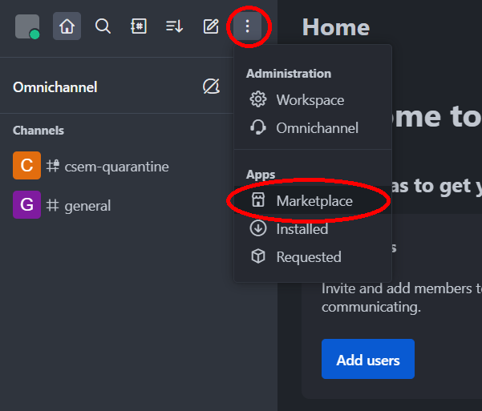
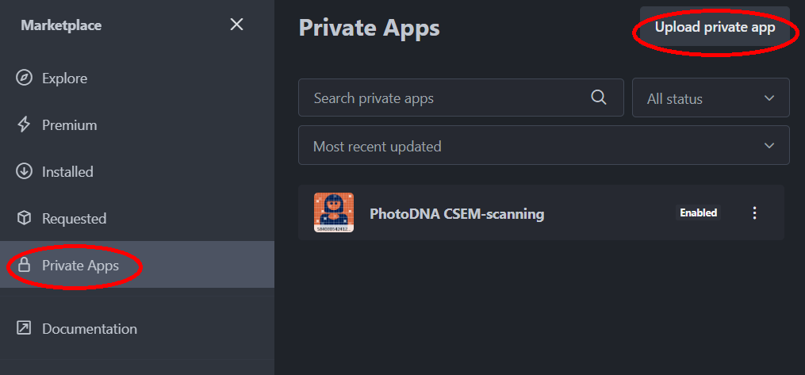
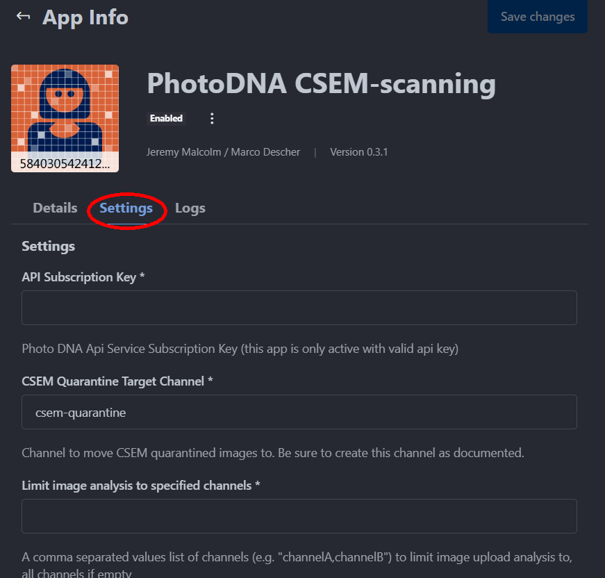
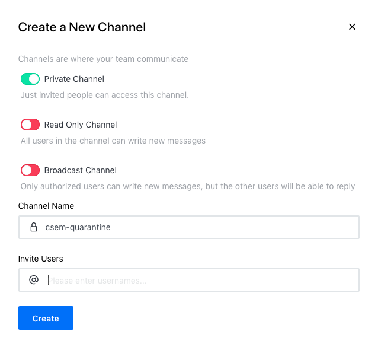
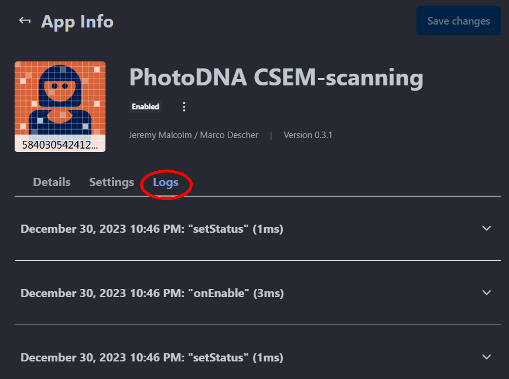

PhotoDNA CSEM scanning App
==========================

This [Rocket.Chat App](https://developer.rocket.chat/apps-engine/) validates uploaded images against the [Microsoft PhotoDNA cloud service](https://www.microsoft.com/en-us/photodna), moves them to a quarantine channel or deletes them before they are shown, and, when configured to do so, reports each match to the National Center for Missing and Exploited Children (NCMEC).

Prerequisites
=============

* Git
* Node.js version 22 or newer (required by `@rocket.chat/apps-compiler`, which `rc-apps package`/`deploy` depend on)
* [Rocket.Chat Apps-Engine CLI](https://developer.rocket.chat/apps-engine/getting-started/rocket.chat-app-engine-cli)
* A Rocket.Chat server version 3.8.0 or newer

Installation
============

Method 1: package as .zip
-------------------------

1. Clone this repository
2. run `npm install`
3. run `rc-apps package`

The resulting package goes in the 'dist' directory in the project folder as a .zip file. Rocket.Chat administrators can upload the .zip as a Private App through the Marketplace interface.




Method 2: deploy directly to server
-----------------------------------

1. Clone this repository
2. run `npm install`
3. Create a file called ``.rcappsconfig`` that resembles this:
```
{
    "url": "https://server.url",
    "username": "admin_username",
    "password": "admin_password",
    "ignoredFiles": [
        "**/README.md",
        "**/package-lock.json",
        "**/package.json",
        "**/eslint.config.js",
        "**/tsconfig.json",
        "**/*.js",
        "**/*.js.map",
        "**/*.d.ts",
        "**/*.spec.ts",
        "**/*.test.ts",
        "**/dist/**",
        "**/.*"
    ]
}
```
4. run `rc-apps deploy`

This method is very convenient for localhost testing and debugging, when you are making frequent minor changes and need to deploy them to your local RC instance.

Obtaining the required configuration credentials
================================================

* The PhotoDNA credentials can be acquired via https://www.microsoft.com/en-us/photodna/cloudservice.
* To receive the NCMEC credentials for automated report functionality, write an email to espteam@ncmec.org to request the registration form.

Configuration
=============

As Administrator go to Marketplace > Private Apps and click on `Photo DNA CSEM-scanning`. This will open the App Info page:



The service will not be active until you enter your API key in the `API Subscription Key` field. This corresponds to the *primary key* received during the PhotoDNA registration.

In `CSEM Quarantine Target Channel` you have to provide the channel ID where quarantined messages will move to. Please be sure to have this channel created like shown in the following image:



If the target channel does not exist, the image will be removed from the message.

In `Limit image analysis to specified channels` you may provide a comma-separated list of channels to limit the analysis to. In the depicted setting, only images uploaded in the channel `testchannel` will be subject to investigation by this app.

Troubleshooting
===============

The app generates logs when it screens images. They are reachable from the App Info page:



Setting up a local Rocket.Chat instance for testing and debugging is [very easy with Docker](https://docs.rocket.chat/deploy/deploy-rocket.chat/deploy-with-docker-and-docker-compose). If Docker Desktop's licensing terms are not favorable for your situation, [Rancher Desktop](https://rancherdesktop.io/) is an effective, free alternative.

If you're trying to use `npm` in PowerShell and a package has an @ symbol in the name, be sure to quote the package name, otherwise PowerShell may interpret the @ as the splat operator.

`@rocket.chat/apps-cli@1.14.0`'s bundled `@rocket.chat/apps-compiler@0.7.0` has a pre-existing bug (confirmed to reproduce on a clean, untouched checkout, so it's not specific to this app) that affects any App with a class in its own file that's instantiated in the main App class's constructor: `AppsEngineValidator.compiledRequire()` incorrectly unwraps modules that have exactly one export, returning the bare class instead of the module's exports object. This surfaces as `TypeError: <SomeClass>_1.<SomeClass> is not a constructor` when running `rc-apps package` or `rc-apps deploy`. It only affects that one packaging-time sanity check, not the actual compiled app or how a real Rocket.Chat server runs it. Workaround: comment out the `this.appValidator.checkInheritance(...)` call in `TypescriptCompiler.js` (around line 172 as of `apps-compiler@0.7.0`; the exact line drifts between versions).
* If installed globally: `%AppData%\npm\node_modules\@rocket.chat\apps-cli\node_modules\@rocket.chat\apps-compiler\compiler\TypescriptCompiler.js` (Windows) or `$(npm list -g | head -1)/node_modules/@rocket.chat/apps-cli/node_modules/@rocket.chat/apps-compiler/compiler/TypescriptCompiler.js` (*nix)
* If run via `npx`, it's cached instead, e.g. `%LocalAppData%\npm-cache\_npx\<hash>\node_modules\@rocket.chat\apps-compiler\compiler\TypescriptCompiler.js` on Windows — find the exact path with `npx --yes @rocket.chat/apps-cli --version` and checking npm's npx cache directory.

_-J. F. Gaulter 2023-12-31_


Preventing child sexual abuse
=============================
For information on protecting your users who are at risk of being caught up in child sexual abuse, either as a victim or as a potential perpetrator, [Prostasia Foundation](https://prostasia.org) can help. We offer consulting services to platforms to help them eliminate abuse without interfering with the free speech of legitimate users. Our [Get Help page](https://prostasia.org/get-help) also offers a variety of support options for users, including the MAP Support Chat forum for which this app was originally developed.

Changelog
=========
* 0.2.0 
  * Allow to limit analysis to specific rooms
* 0.2.1
  * Optimistic removal of `Converting circular structure to JSON`
* 0.2.2
  * Limit analysis to room names setting is now case-insensitive
  * Fix `Converting circular structure to JSON` bug
* 0.2.3
  * Added information about CSAM prevention resources
* 0.3.0
  * Added automated report functionality (configurable)
* 0.3.1
  * Patched minimatch from 3.0.4 to 3.1.2 to mitigate security vulnerability
* 0.3.2
  * Fix `Invalid or missing request parameter(s)` bug
* 0.3.3
  * Implemented setting to watch all direct rooms (DMs)
* 0.3.4
  * Modernized tooling: updated @types/node and typescript to current versions, migrated linting from tslint to eslint
  * Upgraded @rocket.chat/apps-engine from ^1.19.0 to ^1.64.1, resolving all npm audit vulnerabilities
  * Restructured source files into config/ and lib/ folders; no behavior changes

Todos / Caveat
==============

* Currently the user posting the matching image does not see any actions happening, just the message not occuring.
* The images are transported to the Microsoft PhotoDNA Service. The Edge-Hash algorithm is not implemented.
* App logging is too verbose at the moment https://github.com/RocketChat/Rocket.Chat/issues/13312
* Real user IP is not available for automated report functionality https://github.com/RocketChat/feature-requests/issues/433
* If the PhotoDNA API request occurs while the server is momentarily disconnected from the network, the result of the call will be undefined. It will not appear as a match, and the App will let the image through, even though it has not been confirmed to _not_ match.
